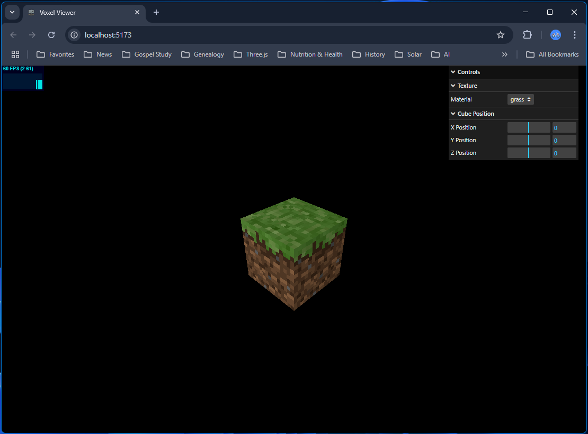
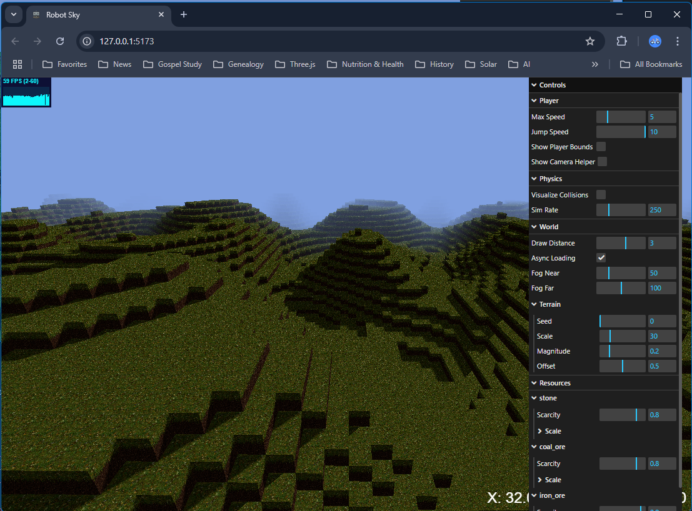

# RobotSky
My educational development to learn how to make a voxel world similar to Minecraft. Although this is not Java (the original language of Minecraft), it is JavaScript which allows the game to run in a modern browser. The development stages are available as separate projects.

## Game features:
- First person camera (player)
- WASD player movement controls
- Third person orbital camera
- Block definition including texture
- Chunk definition with simplex noise terrain generation
- World generation from multiple chunks
- Infinite world generation as the player moves
- Voxel Viewer to visualize a single voxel with different textures
- Physics for gravity and collision detection

Development based on excellent YouTube tutorial by Dan Greenheck @ https://www.youtube.com/playlist?list=PLtzt35QOXmkKALLv9RzT8oGwN5qwmRjTo

## Voxel Viewer

## Robot Sky

## Usage
- Download a project
- Open the project in VSCode
- Go to terminal
  - npm install
  - npm run dev
